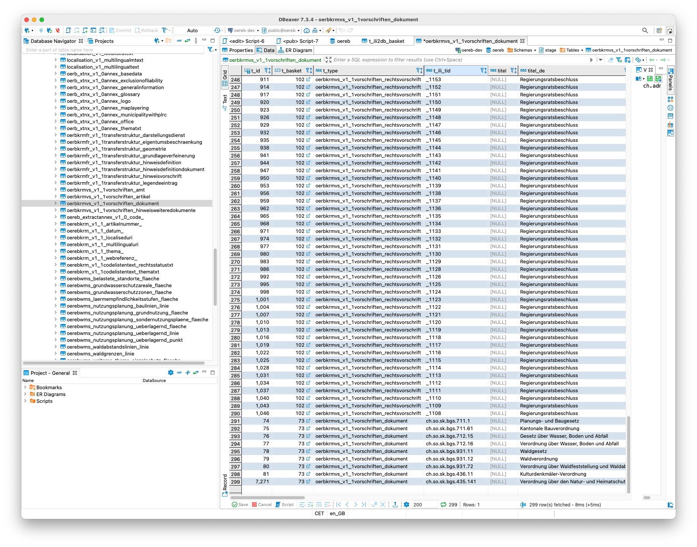
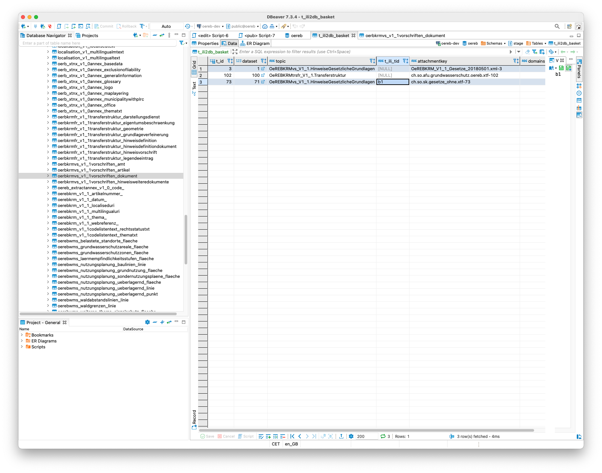

# ili2pg_update_oereb-db

## Datenbank
```
docker run --rm --name oereb-db -p 54321:5432 --hostname primary \
-e PG_DATABASE=oereb -e PG_LOCALE=de_CH.UTF-8 -e PG_PRIMARY_PORT=5432 -e PG_MODE=primary \
-e PG_USER=admin -e PG_PASSWORD=admin \
-e PG_PRIMARY_USER=repl -e PG_PRIMARY_PASSWORD=repl \
-e PG_ROOT_PASSWORD=secret \
-e PG_WRITE_USER=gretl -e PG_WRITE_PASSWORD=gretl \
-e PG_READ_USER=ogc_server -e PG_READ_PASSWORD=ogc_server \
-v /tmp:/pgdata \
sogis/oereb-db:latest
```

## Daten importieren
```
java -jar /Users/stefan/apps/ili2pg-4.3.1/ili2pg-4.3.1.jar --dbhost localhost --dbport 54321 --dbdatabase oereb --dbusr postgres --dbpwd secret --disableValidation --dbschema stage --defaultSrsCode 2056 --strokeArcs --models OeREBKRMvs_V1_1 --dataset OeREBKRM_V1_1_Gesetze --replace OeREBKRM_V1_1_Gesetze_20180501.xml
```

```
java -jar /Users/stefan/apps/ili2pg-4.3.1/ili2pg-4.3.1.jar --dbhost localhost --dbport 54321 --dbdatabase oereb --dbusr postgres --dbpwd secret --disableValidation --dbschema stage --defaultSrsCode 2056 --strokeArcs --models OeREBKRMvs_V1_1 --dataset ch.so.sk.gesetze --replace ch.so.sk.gesetze_ohne.xtf
```

```
java -jar /Users/stefan/apps/ili2pg-4.3.1/ili2pg-4.3.1.jar --dbhost localhost --dbport 54321 --dbdatabase oereb --dbusr postgres --dbpwd secret --disableValidation --dbschema stage --defaultSrsCode 2056 --strokeArcs --models OeREBKRMtrsfr_V1_1 --dataset ch.so.afu.grundwasserschutz --replace ch.so.afu.grundwasserschutz.oereb.xtf
```


## Gesetze updaten

Vor dem Update der Gesetze mit ili2pg muss dem Gesetzes-Basket in der Tabelle `t_ili2db_basket` eine eindeutige BID in der Spalte `t_ili_tid` zugewiesen werden. Diese muss der BID des zu importierenden File entsprechen, in unserem Fall `b1`.


Update mit ili2pg:

```
java -jar /Users/stefan/apps/ili2pg-4.3.1/ili2pg-4.3.1.jar --dbhost localhost --dbport 54321 --dbdatabase oereb --dbusr postgres --dbpwd secret --disableValidation --dbschema stage --defaultSrsCode 2056 --strokeArcs --models OeREBKRMvs_V1_1 --dataset ch.so.sk.gesetze --importTid --importBid --update ch.so.sk.gesetze_mit.xtf
```

Die Gesetze wurden in der entsprechenden Tabelle upgedatet, d.h. in unserem Fall wurde das neue hinzugefügt. Die bereits identisch bestehenden wurden nicht verändert und sie behalten ihren Primary Key (`t_id`):



Es wurde korrekterweise kein neuer Basket hinzugfügt. Das Feld `attachementkey` wird anscheinend nicht nachgeführt (?):


